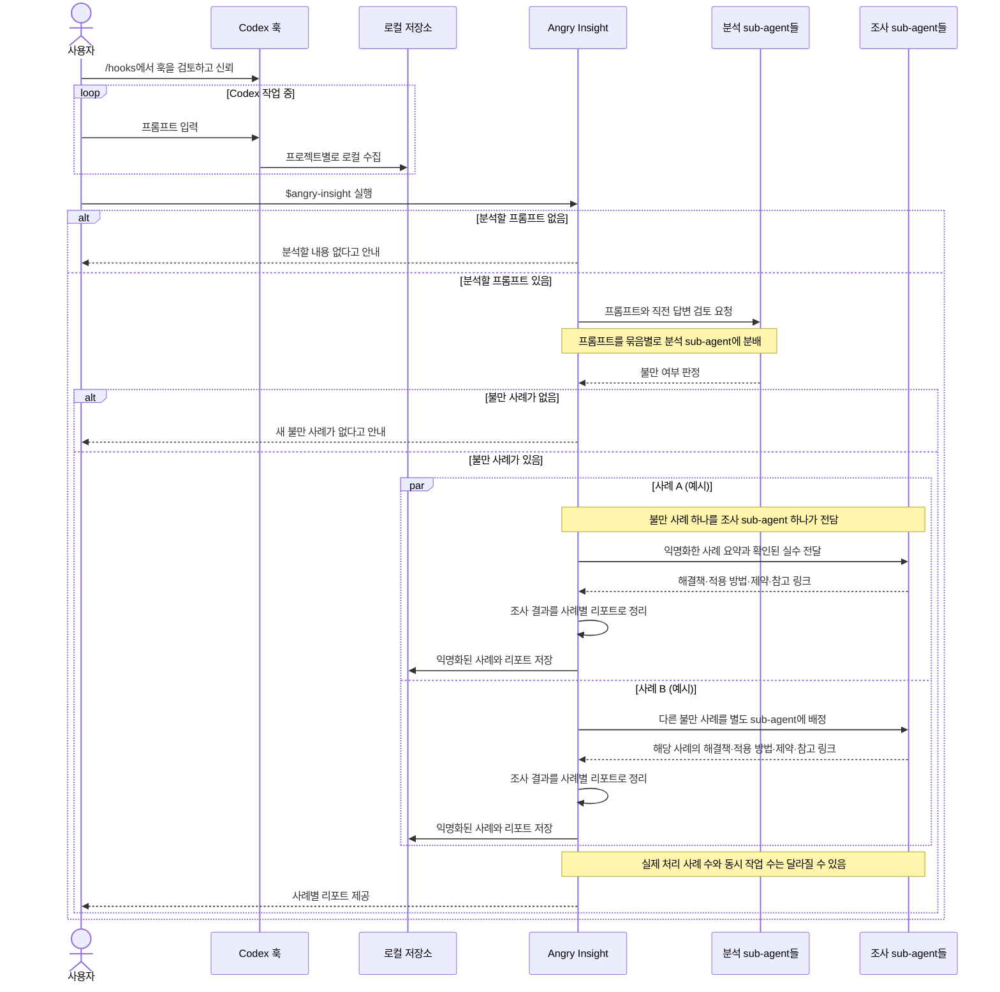

# Angry Insight

> Codex도 Claude code처럼 `/insight`가 있으면 참 좋을텐데.

## 1. 목적

```text
아니 개빡치네 내가 이 패키지 작업할 땐 저장소랑 README에 있는 노션 링크부터 확인하라고 했잖아. 그거 무시하고 개같이 구현하냐
시간하고 토큰 다 날렸네 같은 말 몇 번을 쳐해야 알아듣는 거야?
```

Codex가 요청을 놓치거나 같은 실수를 반복해 답답했던 경험을 다음 작업의 개선으로 연결하고 싶을 때 사용합니다. 불만이 생긴 대화를 다시 설명할 필요 없이, `$angry-insight`를 실행하면 문제 해결을 위한 리포트를 생성합니다.

## 2. 시작하기

1. 플러그인을 설치하고 Codex CLI에서 `/hooks`를 실행합니다.
2. Angry Insight의 프롬프트 수집(`UserPromptSubmit`) 및 세션 준비(`SessionStart`) 훅을 검토하고 신뢰한 뒤 새 Codex 세션을 시작합니다.
3. Codex 작업 중 불만이 생긴 뒤, 해당 프로젝트에서 `$angry-insight`를 실행합니다.

훅을 신뢰하면 프롬프트가 프로젝트별로 로컬 수집됩니다. 스킬은 실행한 프로젝트에서 아직 분석하지 않은 내용만 확인합니다.

## 3. 결과

불만 사례마다 개선안을 확인할 수 있습니다.

- 어떤 일이 있었고 Codex가 무엇을 놓쳤는지에 대한 요약
- 상황에 맞는 해결책과 각 방법의 적용 범위
- 권고하는 방법과 바로 적용할 지침·설정·절차
- 제안의 근거가 되는 참고 링크와 적용 범위·한계

분석할 불만이 없으면 새 사례가 없다고 알려줍니다.

### 결과 예시

아래는 위 사례를 분석했을 때 사용자에게 보여줄 결과의 예입니다.

> ## 사례: 참고 자료의 제약을 반영하지 않은 구현
>
> **분류:** `complaint`
>
> ### 무슨 일이 있었나
>
> 사용자는 구현 전에 다른 저장소와 README에 연결된 문서를 참고하라고 했지만, Codex가 자료를 확인하지 않고 구현했습니다. 그 결과 이미 전달된 제약을 놓쳐 시간과 토큰을 낭비했습니다. 드러난 원인은 요청에 명시된 참고 자료를 구현 전 확인하고 작업 계획에 반영하는 절차가 없었던 점입니다.
>
> ### 가능한 해결책
>
> - **저장소 지침:** 이 프로젝트에서 반복되는 작업 원칙이라면 저장소 루트 `AGENTS.md`에 두는 방식이 적절합니다. Codex는 작업 전에 저장소 지침을 읽을 수 있습니다 ([Codex의 지침 처리](https://github.com/openai/codex/blob/main/codex-rs/core/src/agents_md.rs)).
> - **재사용 스킬:** 같은 자료 확인 절차를 여러 저장소에서 반복한다면 스킬로 제공할 수 있습니다. 적용 범위가 넓어지는 대신, 이 프로젝트에만 필요한 규칙까지 공통 지침으로 만들지 않도록 해야 합니다 ([Codex 작업 흐름과 재사용 스킬 예시](https://github.com/openai/openai-cookbook/blob/main/examples/codex/iterating-development-workflows-with-codex.md)).
>
> ### 권고 및 적용안
>
> 이 사례는 현재 저장소의 작업 지침에 해당하므로 루트 `AGENTS.md`를 갱신합니다. `작업 절차` 섹션이 있으면 그 아래에, 없으면 파일 끝에 다음을 추가합니다.
>
> ```md
> ## 작업 전 참고 자료 확인
>
> - 사용자가 참고 대상으로 지정한 저장소, 문서, URL을 코드 수정 전에 확인한다. README에서 해당 작업과 관련해 연결한 문서도 읽는다.
> - 각 자료에서 현재 작업에 적용되는 요구사항과 제약을 추려, 수정 전에 간단히 요약한다.
> - 자료를 찾거나 열 수 없으면 내용을 추측하지 말고, 어떤 자료에 접근하지 못했는지 사용자에게 알린다.
> - 참고 자료의 요구사항을 작업 계획과 구현 결과에 반영했는지 확인한다.
> ```
>
> ### 적용 범위와 한계
>
> 위 문구는 기존 자료에서 그대로 가져온 해결책이 아니라, 이 사례에 맞춘 AI 제안입니다. 현재 저장소의 작업에는 적용되지만 다른 저장소에는 자동 적용되지 않습니다. 외부 자료에 접근할 수 없는 경우에도 내용을 대신 가져오지는 못합니다.

예시는 결과 형식을 보여주기 위한 것이며, 실제 해결책과 권고는 분석한 사례에 따라 달라집니다.

## 4. 동작 흐름

훅을 신뢰하면 프롬프트가 프로젝트별로 로컬 수집됩니다. `$angry-insight`를 실행하면 현재 프로젝트에서 아직 분석하지 않은 프롬프트를 확인합니다.



- 불만으로 확인되지 않은 메시지는 사례로 보관하지 않습니다. 한 번 분석한 사례를 다시 판단하지 않습니다.
- 해결책은 OpenAI, Anthropic, Hacker News, GitHub, npm 그리고 AI 자체 판단에서 찾습니다.

## 5. 데이터 생명 주기와 민감정보

- 분석 대기 중인 프롬프트는 로컬에 최대 30일간 보관됩니다.
- 분석을 실행하면 분류를 위해 프롬프트 원문과 찾을 수 있는 직전 Codex 답변이 현재 Codex 모델의 문맥에 포함됩니다.
- 웹 검색에는 민감 정보를 정제한 사례 요약만 사용합니다.
- 불만으로 분류된 사례의 요약·조사 보고서와 프로젝트·시각 정보는 삭제를 요청할 때까지 로컬에 보관합니다.
- 불만이 아닌 메시지는 분석 후 저장하지 않습니다.
- 삭제 후에도 훅을 신뢰한 상태라면 새 프롬프트는 계속 수집됩니다. 수집 중지하려면 `UserPromptSubmit` 훅의 신뢰를 해제하거나 비활성화해주세요.
