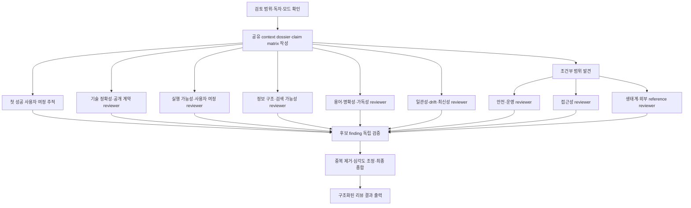

# Developer Documentation Review

## 1. 목적과 검토 범위

`dev-docs-review`는 작성한 개발 문서를 리뷰하는 읽기 전용 스킬입니다. 전체 문서 감사나 특정 문서 변경 리뷰에 사용할 수 있으며, 문서·소스·테스트·외부 reference를 근거로 수정이 필요한 지점을 보고합니다.

다른 개발 문서의 우수한 문서 작성 관점과 실제 코드를 참조해 문서의 신뢰성과 컨텐츠 문제를 탐지합니다.

## 2. 적용 가능한 상황

- README, 튜토리얼, API reference, how-to 또는 변경 문서가 현재 구현과 맞는지 확인해야 하는 경우
- 예제가 실제 계약과 맞는지 확인해야 하는 경우
- 가이드에서 설치·설정부터 첫 성공, 실패 복구, reset·cleanup까지 독자가 완주할 수 있는지 점검해야 하는 경우
- 여러 문서에 반복된 설명이나 서로 다른 canonical source가 있어 drift 가능성을 확인해야 하는 경우
- 원격 디버깅, 파일 삭제, credential, production data처럼 안전한 범위와 cleanup이 필요한 절차를 문서화한 경우

## 3. 리뷰 관점

다음 핵심 관점은 모든 문서 리뷰에서 실행합니다.

- **기술 정확성·공개 계약**: 실제 코드와 관련 기술을 분석해 정확한 표현 여부를 확인합니다.
- **실행 가능성·사용자 여정**: setup부터 첫 성공, 기대 결과, 실패 복구, reset, cleanup과 다음 단계를 문서 컨텐츠로 수향 가능한지 확인합니다.
- **정보 구조·검색 가능성**: 문서 목적, heading, navigation, link, canonical source와 중복 버전을 확인합니다.
- **용어·명확성·가독성**: 난잡한 표현, 프로젝트·생태계 용어, casing, 정의, 문장 구조, heading, code example, table, 모호한 표현과 독자 이해 가능성을 확인합니다.
- **일관성·drift·최신성**: 반복 claim, 버전 지원, deprecated interface, generated copy와 branch/release 상태를 확인합니다.

다음 관점은 명확한 변경 형태가 있을 때만 실행합니다.

- **안전·운영**: destructive command, external call, credential, production data 등 위험한 절차가 포함된 경우
- **접근성**: UI·이미지 기반 안내, heading, link text, alt text, table, code example 또는 시각 정보가 포함된 경우
- **생태계·외부 reference**: framework, library, API, protocol, standard, peer dependency, adapter 또는 공식 integration 주장이 포함된 경우

각 관점 reviewer는 동일한 공유 dossier를 사용하지만 역할별 rubric과 관련 파일만 전달받습니다. 독립 검증과 최종 종합은 메인 review context에서 수행하며, 결과에는 실제 실행된 관점과 생략된 조건부 관점을 함께 출력합니다.

## 4. 증거와 심각도

각 주장은 다음 상태 중 하나로 구분합니다.

- **implemented**: 저장소의 구현·타입·schema·테스트에서 확인됨
- **documented**: 문서에는 적혀 있으나 구현 근거까지 확인하지 못함
- **officially defined**: 관련 생태계의 권위 있는 공식 문서에서 정의됨
- **runtime-observed**: 안전한 실행이나 관찰로 확인됨
- **unverified**: 확인에 필요한 근거가 없거나 실행할 수 없음

심각도는 root cause마다 하나만 사용합니다.

- **blocker**: 문서화된 경로가 실행되지 않거나 현재 공개 계약과 모순되어 중대한 데이터·보안·운영 위험을 만듦
- **high**: 핵심 작업을 막거나 반복적으로 잘못된 결과를 만들며, 누락된 prerequisite나 복구 경로가 흔한 실패를 유발함
- **medium**: 독자에게 상당한 추측이나 되돌아가기를 요구하지만 안정적인 우회 방법이 있음
- **low**: 작업을 막지는 않지만 명확성·형식·접근성·일관성을 개선할 필요가 있음

문장 취향, 일반적인 lint 요청, 사전부터 존재한 문제나 근거 없는 추측은 finding으로 올리지 않습니다.

## 5. 동작 흐름



공유 dossier와 첫 성공 사용자 여정을 먼저 준비한 뒤, 독립적인 리뷰 관점은 병렬로 수행합니다. 조건부 reviewer는 해당 변경 형태가 있을 때만 실행하며, 후보 finding의 독립 검증과 최종 종합은 메인 review context에서 수행합니다.

## 6. 결과 형식

리뷰 결과는 다음 형식으로 작성합니다. 발견 사항이 없더라도 검토 범위와 남은 한계를 기록합니다.

```markdown
## Audit scope and verification
- 대상 독자:
- 검토 모드: full audit | change review
- 검토한 문서와 source paths:
- 실행한 명령·테스트·빌드:
- runtime 확인:

## Review perspectives
- 병렬 실행한 핵심 reviewer:
- 조건부로 실행한 reviewer:
- 조건에 따라 생략한 reviewer와 이유:
- sub-agent를 사용할 수 없어 순차 fallback을 사용했는지:

## Findings by severity

### blocker: 제목
- Location: `docs/example.md`, `## 섹션` 또는 `path/to/file.ts:42`
- Problem: 문서의 구체적인 문제
- Evidence: 구현·type·schema·test·공식 문서·실행 결과의 정확한 근거
- User impact: 독자가 수행하지 못하거나 잘못 이해할 작업과 위험
- Recommended structure and replacement wording: 최소 수정 구조와 검증된 이름·문법을 사용한 대체 문구

### high: 제목
- Location:
- Problem:
- Evidence:
- User impact:
- Recommended structure and replacement wording:

### medium: 제목
- Location:
- Problem:
- Evidence:
- User impact:
- Recommended structure and replacement wording:

### low: 제목
- Location:
- Problem:
- Evidence:
- User impact:
- Recommended structure and replacement wording:

## Missing user tasks
- 문서만으로 완료할 수 없는 독자의 작업:
- 필요한 prerequisite·복구·cleanup:

## Unverified or remaining limits
- 확인하지 못한 claim:
- 접근할 수 없었던 runtime·generated output·외부 source:
- 확인하지 못한 이유:
```
