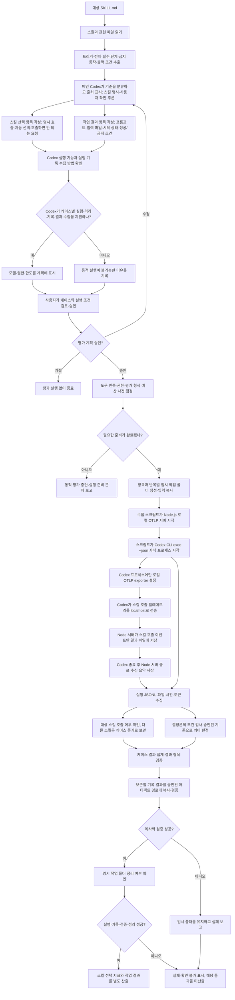

# Skill Evaluation

`skill-evaluation`은 Codex가 요청에 맞는 스킬을 자동으로 선택하는지와, 실행결과가 기준을 충족하는지 평가합니다.

## 1. 사용 방법

```text
$skill-evaluation skills/api-scenario-forge
```

- 스킬 이름만 입력해도 되지만, 같은 이름의 스킬이 여러 곳에 있으면 경로를 지정하세요.
- Codex는 평가 계획을 제안합니다. 이 단계에서는 평가를 실행하지 않고 피드백을 주고 받습니다.
- 계획을 수정한 뒤에는 최종 계획을 다시 보여줍니다. 사용자가 명시적으로 승인한 뒤에만 평가를 실행합니다.

## 2. 예시

아래는 `api-scenario-forge`를 평가한다고 가정한 예입니다. 실제 평가에서는 대상 스킬을 읽은 뒤 초안을 만들고 사용자에게 확인받습니다.

### A. Codex가 평가 계획을 제안합니다

요청에 따라 Codex는 다음과 같은 계획을 보여줄 수 있습니다.

> # api-scenario-forge
>
> ## 테스트 케이스
>
> ### 자동 선택
>
> - 사용자가 스킬 이름을 지정하지 않고 로컬 앱에서 API 오류 상태를 확인해 달라고 요청하면 이 스킬을 선택하는가?
>
> ### 호출하면 안 되는 요청
>
> - API 시나리오를 바꾸지 않고 오류 안내 문구만 문서로 정리해 달라는 요청에서 이 스킬을 선택하지 않는가? 스킬 설명에 직접 기준이 없어 사용자 확인이 필요합니다.
>
> ### 작업 결과
>
> - 격리된 테스트 앱에서 상세 조회를 `404`로 설정했을 때, 앱에 페이지를 찾을 수 없다는 화면이 표시되는가?
>
> ## 평가 방법
>
> ### 비교 조건
>
> - 두 실행에서 요청·모델·도구·테스트 파일·권한을 동일하게 유지합니다.
> - 대상 스킬이 없는 격리 환경을 만들 수 있으면 그 환경에서 비교합니다. 불가능하면 평가 프롬프트에 강한 사용 금지 지시를 넣은 실행을 별도 조건으로 표시하고, 스킬이 없는 실행과 같은 비교로 합치지 않습니다.
>
> ### 실행 조건
>
> - 승인된 케이스를 분리된 작업 폴더에서 실행하고, 실행 기록과 결과 파일을 수집합니다.
> - Node.js 수집기가 실행별로 로컬에서만 동작하며, 스킬 호출 이벤트를 기록합니다.
> - 실행 모델 이름과 샌드박스·승인 권한의 실제 값을 계획 승인 전에 표시합니다.
>
> ### 반복 횟수와 한도
>
> - 자동 선택 항목은 각 1회, 작업 결과 항목은 각 2회 실행합니다.
> - 전체 실행은 최대 10분, 총 20,000 tokens 사용 시 중단합니다.
>
> ### 파일과 정리
>
> - 로컬 테스트 앱을 사용하며, 앱의 API 요청은 로컬 모의 응답으로 처리합니다.
> - 결과 파일과 실행 기록은 `~/Documents/codex-evaluations/api-scenario-forge/run-001/`에 보존합니다.
> - 스킬 호출 기록과 텔레메트리 수신 요약도 케이스별로 저장합니다.
> - 임시 작업 폴더를 정리하기 전에 보존할 결과와 기록을 위 경로에 복사하고 파일을 확인합니다.
>
> 바꿀 내용이 있으면 알려주시고, 승인하면 실행하겠습니다.

이 제안에서 사용자는 스킬에 적힌 기준과 Codex가 추론한 기준을 구분해 볼 수 있습니다. 불만족스럽거나 잘못된 케이스는 고치거나 평가 대상에서 뺄 수 있습니다.

### B. 평가 계획을 수정합니다

사용자는 초안을 보고 수정할 내용을 요청할 수 있습니다. 예를 들어 이렇게 답합니다.

```text
문서 작성 요청은 이 스킬을 선택하지 않는 것으로 추가해 주세요. 로컬 테스트 앱과 모의 API 응답만 사용하고, 2회 반복해 주세요. 패키지는 설치하지 말고, 실행 기록에서 스킬 호출 여부를 확인할 수 있을 때 진행해 주세요.
```

- Codex는 수정한 계획을 반영합니다.
- 이미 쓸 수 있는 도구가 필요한 기록이나 격리를 지원하지 않으면 평가를 시작하지 않습니다. 추가 설치나 인증이 필요하면 구체적인 준비 항목을 먼저 알리고 사용자 결정을 기다립니다.
- 도구를 임의로 설치하지 않고 일반 모델 호출 결과를 실제 Codex 평가인 것처럼 대신하지 않습니다.
- 수정 요청은 승인으로 간주하지 않습니다. Codex는 변경 사항을 반영한 최종 계획을 다시 보여줍니다.

### C. 사용자가 최종 계획을 승인합니다

최종 계획을 확인한 사용자는 승인합니다.

```text
실행하세요.
```

Codex는 승인된 계획의 조건으로만 평가를 시작합니다. 계획을 더 수정한다면 반복해 승인을 요청합니다.

### D. 평가를 실행하고 결과를 확인합니다

평가가 가능하면 케이스별 실제 스킬 호출을 확인하고, 격리된 앱의 결과 파일과 화면 상태를 성공 조건에 대조합니다. 호출 기록을 받지 못한 실행은 미호출이 아닌 `확인 불가`로 둡니다.

보고서에는 다음과 같은 결과가 들어갑니다.

| 구분 | 확인하는 내용 |
| --- | --- |
| 스킬 선택 | 요청별 기대 동작, 실제 선택, 선택하지 않은 경우, 다른 스킬을 선택한 경우 |
| 작업 결과 | 승인된 성공 조건과 금지 조건의 통과 여부, 스킬 사용/미사용 실행의 차이 |
| 실행 근거 | 실행 기록, 생성된 파일, 화면 캡처 등 확인 가능한 자료 |
| 실행 정보 | 모델, 반복 횟수, 시간, 토큰·도구 사용량, 정리 결과 및 확인하지 못한 항목 |

- 스킬 호출을 확인할 수 없으면 그 케이스는 `확인 불가`로 보고합니다.
- 결과가 일부 누락되거나 검증이 실패한 경우 성공처럼 취급하지 않습니다.
- 선택하면 안 되는 요청에서 스킬을 부른 비율과, 불러야 할 요청에서 놓친 비율은 승인된 케이스에서만 계산하며 실제 사용 전체의 성능을 뜻하지 않습니다.

## 3. 동작 흐름



각 케이스 실행에서 수집 스크립트가 Node.js 프로세스로 로컬 OTLP 서버를 열고, 그 프로세스가 Codex CLI를 자식 프로세스로 실행합니다. Codex의 스킬 호출 텔레메트리는 로컬 서버로만 전송되며, 서버는 스킬 호출 이벤트만 결과 파일에 남긴 뒤 Codex가 끝나면 종료합니다.
