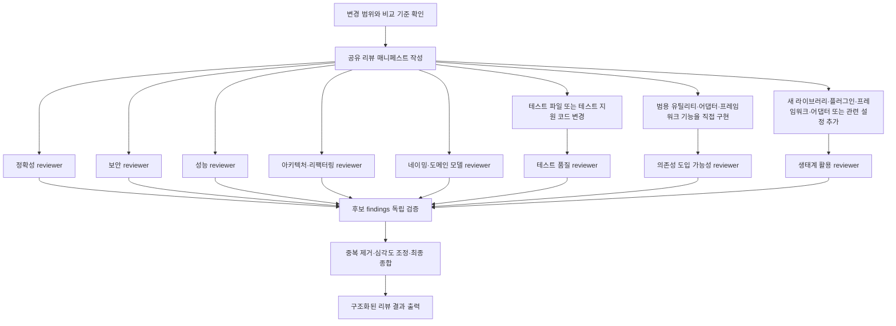

# Strict Review

## 1. 목적과 검토 범위

`strict-review`는 Codex의 기존 빌트인 리뷰 스킬을 확장하는 읽기 전용 리뷰 스킬입니다. 발생했거나 커진 문제를 근거와 함께 구조화해 출력합니다. 출력 결과를 확인해 적절한 리뷰를 반영하면 됩니다.

다음 범위를 리뷰 대상으로 삼을 수 있습니다.

- 커밋 범위 또는 브랜치 간 diff
- Pull Request 변경 사항
- 특정 파일, 심볼 또는 기능 변경

## 2. 사용 예시

```text
$strict-review https://github.com/nayunsang/msw-dev-tool/issues/176 이슈를 구현한 변경 사항을 리뷰해줘. 이슈와 달리 CLI는 해당 기능을 제공하지 않아 UI만 구현했어. 이 범위를 고려해 리뷰해줘.
```

## 3. 리뷰 관점

- **정확성 및 동작**: 성공·실패 경로, 입력 경계, 재시도, 상태 전이, 부작용 순서와 자원 해제를 확인합니다.
- **보안**: 신뢰 경계, 인증·인가, 검증, 민감한 데이터, 안전하지 않은 sink와 설정을 확인합니다.
- **성능**: 반복 작업, 데이터 크기, I/O, 쿼리, 캐시, 재시도, 동시성, 메모리와 hot path를 확인합니다.
- **아키텍처 및 리팩터링**: 책임 분리, 중복 정책, 의존성 방향, 변경 전파, 테스트 경계를 확인합니다.
- **의미론적 네이밍과 도메인 모델**: 이름이 주장하는 상태·역할·도메인 개념과 실제 불변식 및 사용 범위가 일치하는지 확인합니다.
- **테스트 품질**: 테스트 파일·fixture·mock·helper 변경이 있을 때만 활성화하고, 사용자 흐름 또는 caller-facing contract와 실패 진단 가능성을 확인합니다.
- **의존성 도입 가능성**: 범용 유틸리티·어댑터·프레임워크 기능을 직접 자체 구현한 변경에 대해 패키지나 내부 구현 재사용으로 대체할 수 있는지 검토합니다.
- **생태계 활용**: 새 라이브러리·플러그인·프레임워크·어댑터 또는 관련 설정이 추가된 경우 peer dependency, companion integration, runtime·버전 호환성을 확인합니다.

## 4. 동작 플로우와 reviewer 트리거

핵심 reviewer는 모든 리뷰에서 병렬 실행합니다. 선택적 reviewer는 트리거가 존재합니다.



각 reviewer의 후보 결과는 코드 경로, 변경 범위, 호출자·소비자, 경계와 테스트를 근거로 독립 검증합니다. 이후 같은 원인의 중복을 제거하고 심각도를 조정하되, 한 reviewer만 발견한 충분한 근거의 보안·성능·구조 문제도 유지합니다.

## 5. 결과 형식

다음은 모든 주요 섹션과 포함 조건을 보여 주는 예시입니다. 리뷰 결과에 따라 특정 섹션이 생략될 수 있습니다.

```markdown
## P0–P3 Findings
<!-- 확정된 correctness/security/performance/operational 결함.
     없으면 "No findings." 출력 -->

### P1: 제목
- 위치: `path/to/file.ts:42`
- 문제: 변경으로 인해 발생하는 구체적인 결함
- 영향: 영향을 받는 사용자·호출 경로·시스템 경계
- 근거: 코드 흐름과 변경 범위에 대한 증거
- 수정 방향: 작성자가 고려할 수 있는 수정 방향

## R1–R3 Structural and Semantic Findings
<!-- P-level 결함은 아니지만 구조·리팩터링·네이밍 측면의 문제.
     없으면 "No structural findings." 출력 -->

### R1: 제목
- 위치: `path/to/file.ts:18`
- 문제:
- 영향:
- 근거:
- 제안:

## T1–T3 Test-Quality Findings
<!-- 테스트 파일 또는 테스트 지원 코드가 변경된 경우에만 포함.
     없으면 "No test-quality findings." 출력 -->

### T1: 제목
- 위치: `path/to/file.test.ts:30`
- 문제:
- 놓치는 시나리오:
- 근거:
- 제안:

## Dependency Candidates
<!-- 범용 기능 직접 구현 변경과 관련된 의존성 도입 가능성.
     없으면 "No dependency candidates." 출력 -->

- 후보:
- 관련 변경:
- 도입 가능성:
- 확인이 필요한 점:

## Ecosystem Candidates
<!-- 새 라이브러리·플러그인·프레임워크·어댑터·설정과 관련된 생태계 활용.
     없으면 "No ecosystem candidates." 출력 -->

- 후보:
- 관련 변경:
- 활용 가능성:
- 확인이 필요한 점:

## Candidate Risks
<!-- 트리거와 영향 경로는 구체적이지만 완전히 검증되지 않은 위험.
     없으면 "No candidate risks." 출력 -->

### 제목
- 확인된 사실:
- 미확인 조건:
- 잠재 영향:

## Q
<!-- 모호하거나, 답변 필요한 질문이 있을 때만 포함 -->

- 질문:

## Overall Assessment
<!-- 리뷰 범위와 가장 중요한 결론을 간단히 요약 -->

## Coverage and Residual Risks
<!-- 생략한 맥락, 실행하지 못한 reviewer, 남은 불확실성을 기록 -->
```
