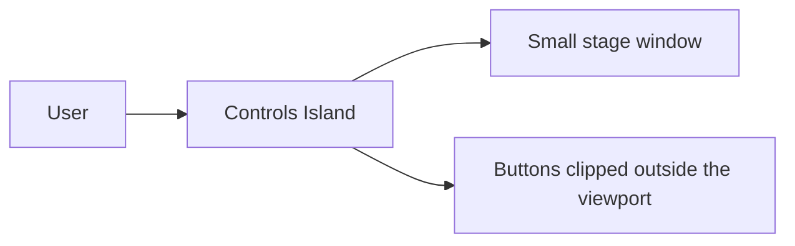
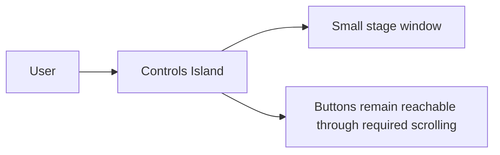

# Pull Request Markdown Components

`write-pr-content`는 전체 PR 본문을 대신 작성하는 스킬이 아니라, 변경
근거가 있을 때 필요한 Markdown fragment만 만드는 하위 스킬 모음입니다.

| 컴포넌트 | 적용 조건 | 출력 | 설명 |
| --- | --- | --- | --- |
| [`functional-change-spec`](../skills/write-pr-content/functional-change-spec/SKILL.md) | 테스트와 diff에서 observable behavior를 추출할 수 있을 때 | Spec fragment | - |
| [`change-diagram`](../skills/write-pr-content/change-diagram/SKILL.md) | 명시적 대상 또는 시각화할 외부 동작이 있을 때 | 새 기능은 After 1개, 기능 변경·버그 수정은 Before/After 2개 다이어그램 | Mermaid fenced block으로 반환하며 내부 helper 호출은 표시하지 않습니다. |
| [`reference-links`](../skills/write-pr-content/reference-links/SKILL.md) | PR에 직접 링크된 이슈 외에 작업 중 참고한 외부 자료가 있을 때 | 근거가 드러나는 링크 목록 | - |
| [`benchmark-results`](../skills/write-pr-content/benchmark-results/SKILL.md) | 성능 변경 의도와 benchmark 입력이 있을 때 | 측정 Environment와 Benchmark 결과를 나타내는 Markdown 표 | 측정 대상에 영향을 주는 소프트웨어, 의존성, 물리적 환경 등 영향가는 것만 기록하고 측정 결과 표를 작성합니다. |
| [`visual-evidence`](../skills/write-pr-content/visual-evidence/SKILL.md) | UI 변경작업이고 격리 브라우저에서 실제 캡처가 가능할 때 | After 또는 Before/After 캡처 | 격리된 Computer Use, 저장소의 Chrome DevTools MCP, Browser CLI 역할을 구분합니다. Before는 사용자 제공 artifact를 받을 수 있고 없다면 작업 이전 코드베이스에서 얻도록 합니다. |
| [`bug-reproduction`](../skills/write-pr-content/bug-reproduction/SKILL.md) | 버그 재현 정보가 부족하지만 테스트·명령·diff에서 복원할 근거가 있을 때 | 재현 절차 fragment | - |

각 스킬은 저장소의 PR 템플릿을 먼저 읽고 해당 heading과 placeholder를
존중합니다. 따라서, PR 템플릿과 관계 없이 사용 가능합니다.

각 하위 스킬의 `SKILL.md`에는 실제 값을 채우기 전의 응답 형식 예시가
포함되어 있습니다. 예시의 placeholder를 근거 없는 값으로 대체하지
않습니다.

## 실제 PR을 넣었을 때의 예상 결과

스킬을 과거 시점의 수기로 작성한 PR에 적용했다고 가정한 예상 결과입니다.

### [#2611 `perf(stage-tamagotchi): exclude duplicate ONNX runtimes`](https://github.com/moeru-ai/airi/pull/2611)

> 데스크톱 어플리케이션의 사이즈를 줄이기 위해 빌드 설정에서 중복된 ONNX 런타임을 제거하는 작업

`functional-change-spec`: `None`
`change-diagram`: `None`

`reference-links`:

- [이전 데스크톱 bundle size 최적화와 측정 환경 (#2603)](https://github.com/moeru-ai/airi/pull/2603) — 중복 ONNX runtime 제외와 artifact 측정 표의 맥락을 참고했습니다.

`benchmark-results`:

#### Environment

| Item | Value |
| --- | --- |
| Operating system | macOS 26.6.2 |
| CPU | Apple M1, 8 cores |
| Architecture | arm64 |
| Node.js | 24.18.1 |
| npm | 11.16.0 |
| pnpm | 11.24.0 |
| Electron | 43.4.1 |
| electron-builder | 26.16.1 |

#### Benchmark

| Workload | Baseline | After | Delta |
| --- | ---: | ---: | ---: |
| Renderer output | 350,027,841 bytes | 350,027,846 bytes | +5 bytes · 0.0% |
| `app.asar` | 1,360,117,408 bytes | 1,222,515,329 bytes | −137,602,079 bytes · 10.1% smaller |
| `app.asar.unpacked` | 223,132,648 bytes | 74,647,540 bytes | −148,485,108 bytes · 66.5% smaller |
| Unpacked macOS application | 1,891,573,024 bytes | 1,605,485,837 bytes | −286,087,187 bytes · 15.1% smaller |

### [#2474 `fix(stage-tamagotchi): prevent controls island overflow in small windows with scroll`](https://github.com/moeru-ai/airi/pull/2474)

> 작은 창에서 메뉴가 잘려나가는 버그를 해결하기 위해 메뉴에 스크롤을 도입

`functional-change-spec`:

### Spec

- 작은 창에서 Controls Island가 viewport 밖으로 잘리지 않고, 세로 공간이 부족하면 메뉴를 세로로 스크롤할 수 있습니다.
- 창 너비가 부족하면 필요한 축으로 가로 스크롤이 활성화되고, main controls는 viewport 안에 유지됩니다.
- Controls Island의 dock 방향과 사용 가능한 공간에 따라 메뉴가 안쪽으로 열리며, profile form과 tooltip 같은 overlay 상호작용은 유지됩니다.

`change-diagram`:

### Before

### After

`reference-links`: `None`

`benchmark-results`: `None`

`visual-evidence`:

| Optional user-provided video | Link |
| --- | --- |
| Narrow & small | [Provided video](https://github.com/user-attachments/assets/1a44ff4f-8fe2-4a05-96a8-59ebf7dafcff) |
| Somewhat generous size | [Provided video](https://github.com/user-attachments/assets/c73dbee4-8c8f-4937-ae1a-eda00178274c) |

`bug-reproduction`: `None`
