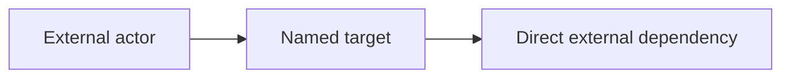
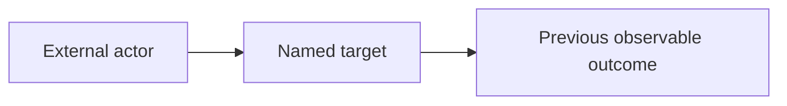
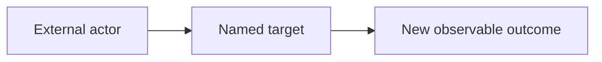

# Change Diagram

Use `$change-diagram` only when the request names a diagram target or the
issue, PR description, referenced issue or commit message, and diff together
show an external behavior that benefits from visualization. If no such target
or behavior can be established, return exactly `None`.

When a target is explicitly named, use that target only; do not widen the
diagram to adjacent behavior merely because it appears in the diff.

Read the pull request template before choosing the fragment heading and
respect its placeholder. Do not copy the full template. Return only the
diagram fragment, with no prose before or after it. Do not fill human-authored
`Abstract`, `Description`, or `Issues` sections.

Model the boundary explicitly:

- Level 0 is the named or inferred target.
- Level 1 contains only actors, callers, systems, or dependencies that
  directly interact with that target.
- Level 2 and deeper implementation functions, helpers, stores, and internal
  calls are omitted. For example, in `Caller → funcA() → funcB()/funcC()`,
  show `Caller` and `funcA()` only.

Output one diagram in the template-compatible fragment for a new feature. For
a functional change or bug fix, output one fragment containing clearly labeled
`Before` and `After` diagrams. For a behavior-preserving refactor, documentation
change, or test-only change, return `None`.

Unless the pull request template explicitly requires another supported diagram
syntax, return Mermaid fenced code blocks (` ```mermaid `). A prose sentence,
ASCII arrow chain, or plain Markdown list is not a valid change-diagram
fragment. Include only relationships and outcomes supported by the available
evidence. Never invent nodes, edges, states, or external systems. Do not
invent behavior, links, numbers, screenshots, or reproduction steps.

Response format examples (replace placeholders with evidence):

For a new feature, return one `After` diagram:



For a functional change or bug fix, return one fragment with both states:

````markdown
### Before



### After


````

Do not expand the diagram with `funcB()` or `funcC()` merely because they are
called inside the named target; those are level-2 implementation details.
